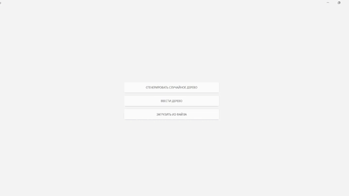

# BinTree

Задание: Дано бинарное дерево. Найти все поддеревья, структура которых совпадает с заданной.

## 👀 Превью


## 🚀 Особенности

- Эффективный алгоритм поиска поддеревьев.
- Поддержка текстового формата ввода дерева.
- Визуализация деревьев.
- Возможность сохранить деревья.

## 📋 Требования

- Компилятор C++ (g++, clang++ или MSVC).
- CMake 3.5 или выше.
- ОС: Windows, Linux или macOS.

## 📥 Установка

1. Склонируйте репозиторий:

   ```bash
   git clone https://github.com/Tacher3000/BinTree.git
   cd BinTree
   ```
2. Создайте директорию для сборки:

   ```bash
   mkdir build && cd build
   ```
3. Сконфигурируйте проект с помощью CMake:

   ```bash
   cmake ..
   ```
4. Соберите проект:

   ```bash
   cmake --build .
   ```
5. Запустите программу:

   ```bash
   ./BinTree
   ```


